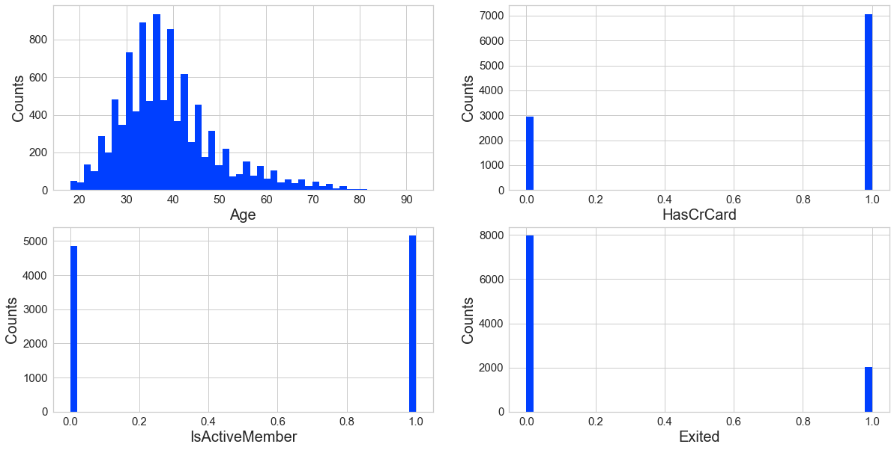
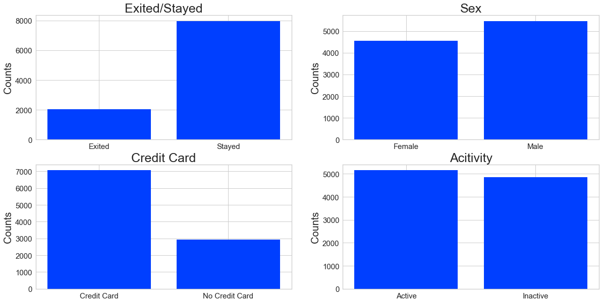
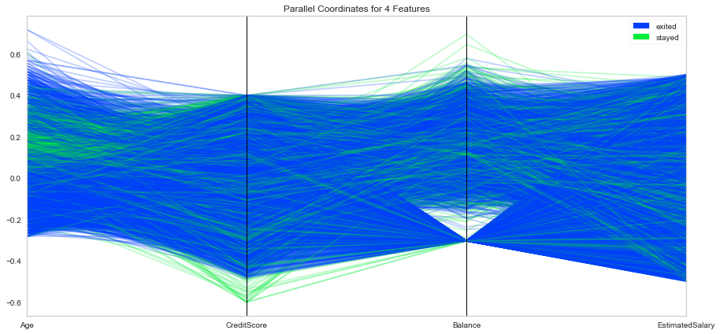
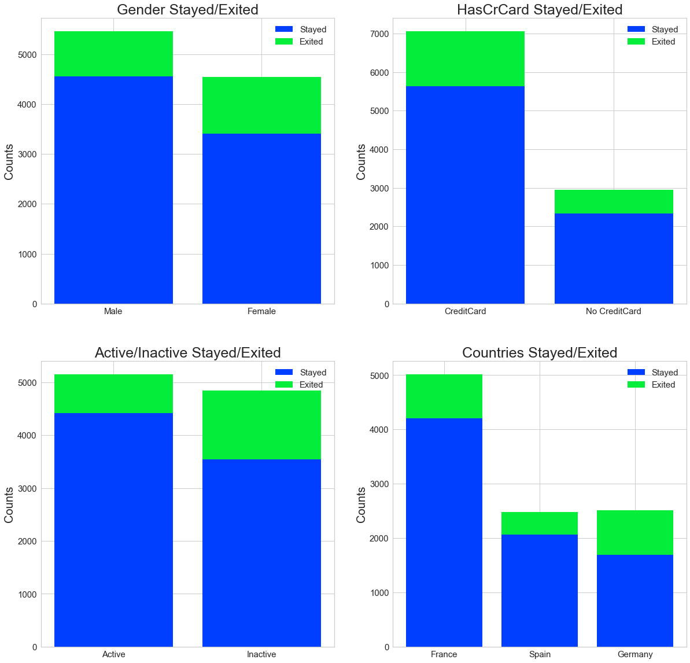

# Exercise 6.3: Original Analysis Case Study

In this case study, as part of phase I, we will perform exploratory data analysis by graphing the features in the dataset.

The dataset is composed of 10,000 customer's record at a bank. The dataset has a total of 14 features 13 of which can be considered as independent variables and 1 as the dependent variable. The goal is to build a  model that can predict whether a customer is likely to stay or exit the bank. The model will predict the dependent variable 'Exited' using the approrpiate set of independent variables 'CreditScore','Geography','Gender','Age','Tenure','Balance','NumberOfProducts','HasCrCard', and 'IsActiveMember'.

We will perform model selection and model validation exercises and use the model the make the desired prediction. The accuracy and percision of the model will be analyzed in the next phases of the study.


```python echo=FALSE


# Load Libraries
import pandas as pd
import matplotlib.pyplot as plt
import numpy as np
import xlrd
```


```python
#Step 1:  Load data into a dataframe
DataFile = "Data/BankCustomers.xlsx"

data = pd.read_excel(DataFile)
```


```python
# Step 2:  check the dimension of the table
print("The dimension of the table is: ", data.shape)
```

    The dimension of the table is:  (10000, 14)
    


```python
#Step 3:  Look at the data
print(data.head(5))
```

       RowNumber  CustomerId   Surname  CreditScore Geography  Gender  Age  \
    0          1    15634602  Hargrave          619    France  Female   42   
    1          2    15647311      Hill          608     Spain  Female   41   
    2          3    15619304      Onio          502    France  Female   42   
    3          4    15701354      Boni          699    France  Female   39   
    4          5    15737888  Mitchell          850     Spain  Female   43   
    
       Tenure    Balance  NumOfProducts  HasCrCard  IsActiveMember  \
    0       2       0.00              1          1               1   
    1       1   83807.86              1          0               1   
    2       8  159660.80              3          1               0   
    3       1       0.00              2          0               0   
    4       2  125510.82              1          1               1   
    
       EstimatedSalary  Exited  
    0        101348.88       1  
    1        112542.58       0  
    2        113931.57       1  
    3         93826.63       0  
    4         79084.10       0  
    


```python
#Step 5:  what type of variables are in the table 
print("Describe Data")
print(data.describe())
```

    Describe Data
             RowNumber    CustomerId   CreditScore           Age        Tenure  \
    count  10000.00000  1.000000e+04  10000.000000  10000.000000  10000.000000   
    mean    5000.50000  1.569094e+07    650.528800     38.921800      5.012800   
    std     2886.89568  7.193619e+04     96.653299     10.487806      2.892174   
    min        1.00000  1.556570e+07    350.000000     18.000000      0.000000   
    25%     2500.75000  1.562853e+07    584.000000     32.000000      3.000000   
    50%     5000.50000  1.569074e+07    652.000000     37.000000      5.000000   
    75%     7500.25000  1.575323e+07    718.000000     44.000000      7.000000   
    max    10000.00000  1.581569e+07    850.000000     92.000000     10.000000   
    
                 Balance  NumOfProducts    HasCrCard  IsActiveMember  \
    count   10000.000000   10000.000000  10000.00000    10000.000000   
    mean    76485.889288       1.530200      0.70550        0.515100   
    std     62397.405202       0.581654      0.45584        0.499797   
    min         0.000000       1.000000      0.00000        0.000000   
    25%         0.000000       1.000000      0.00000        0.000000   
    50%     97198.540000       1.000000      1.00000        1.000000   
    75%    127644.240000       2.000000      1.00000        1.000000   
    max    250898.090000       4.000000      1.00000        1.000000   
    
           EstimatedSalary        Exited  
    count     10000.000000  10000.000000  
    mean     100090.239881      0.203700  
    std       57510.492818      0.402769  
    min          11.580000      0.000000  
    25%       51002.110000      0.000000  
    50%      100193.915000      0.000000  
    75%      149388.247500      0.000000  
    max      199992.480000      1.000000  
    


```python
# Step 6a: Summary of object type data
print("Summarized Data")
print(data.describe(include=['O']))
```

    Summarized Data
           Surname Geography Gender
    count    10000     10000  10000
    unique    2932         3      2
    top      Smith    France   Male
    freq        32      5014   5457
    


```python
# Step 6b: Summary of numeric type data
print("Summarized Data")
print(data.describe(include=np.number))
```

    Summarized Data
             RowNumber    CustomerId   CreditScore           Age        Tenure  \
    count  10000.00000  1.000000e+04  10000.000000  10000.000000  10000.000000   
    mean    5000.50000  1.569094e+07    650.528800     38.921800      5.012800   
    std     2886.89568  7.193619e+04     96.653299     10.487806      2.892174   
    min        1.00000  1.556570e+07    350.000000     18.000000      0.000000   
    25%     2500.75000  1.562853e+07    584.000000     32.000000      3.000000   
    50%     5000.50000  1.569074e+07    652.000000     37.000000      5.000000   
    75%     7500.25000  1.575323e+07    718.000000     44.000000      7.000000   
    max    10000.00000  1.581569e+07    850.000000     92.000000     10.000000   
    
                 Balance  NumOfProducts    HasCrCard  IsActiveMember  \
    count   10000.000000   10000.000000  10000.00000    10000.000000   
    mean    76485.889288       1.530200      0.70550        0.515100   
    std     62397.405202       0.581654      0.45584        0.499797   
    min         0.000000       1.000000      0.00000        0.000000   
    25%         0.000000       1.000000      0.00000        0.000000   
    50%     97198.540000       1.000000      1.00000        1.000000   
    75%    127644.240000       2.000000      1.00000        1.000000   
    max    250898.090000       4.000000      1.00000        1.000000   
    
           EstimatedSalary        Exited  
    count     10000.000000  10000.000000  
    mean     100090.239881      0.203700  
    std       57510.492818      0.402769  
    min          11.580000      0.000000  
    25%       51002.110000      0.000000  
    50%      100193.915000      0.000000  
    75%      149388.247500      0.000000  
    max      199992.480000      1.000000  
    

# Histogram of ['Age', 'HasCrCard', 'IsActiveMember', 'Exited']


```python
# set up the figure size
plt.rcParams['figure.figsize'] = (20, 10)

# make subplots
fig, axes = plt.subplots(nrows = 2, ncols = 2)

# Specify the features of interest
num_features = ['Age', 'HasCrCard', 'IsActiveMember', 'Exited']
xaxes = num_features
yaxes = ['Counts', 'Counts', 'Counts', 'Counts']

# draw histograms
axes = axes.ravel()
for idx, ax in enumerate(axes):
    ax.hist(data[num_features[idx]].dropna(), bins=50)
    ax.set_xlabel(xaxes[idx], fontsize=20)
    ax.set_ylabel(yaxes[idx], fontsize=20)
    ax.tick_params(axis='both', labelsize=15)
plt.show()
```





# Barchart comparing the number of:

- **Exits vs stays**
- **Males vs. Female**
- **Has credit card vs does not have credit card**
- **active members vs inactive members**


```python
# make subplots
fig, axes = plt.subplots(nrows = 2, ncols = 2)

# make the data read to feed into the visulizer
X_Exited = data.replace({'Exited': {1: 'Exited', 0: 'Stayed'}}).groupby('Exited').size().reset_index(name='Counts')['Exited']
Y_Exited = data.replace({'Exited': {1: 'Exited', 0: 'Stayed'}}).groupby('Exited').size().reset_index(name='Counts')['Counts']
# make the bar plot
axes[0,0].bar(X_Exited, Y_Exited)
axes[0,0].set_title('Exited/Stayed', fontsize=25)
axes[0,0].set_ylabel('Counts', fontsize=20)
axes[0,0].tick_params(axis='both', labelsize=15)

# make the data read to feed into the visulizer
X_Sex = data.groupby('Gender').size().reset_index(name='Counts')['Gender']
Y_Sex = data.groupby('Gender').size().reset_index(name='Counts')['Counts']
# make the bar plot
axes[0,1].bar(X_Sex, Y_Sex)
axes[0,1].set_title('Sex', fontsize=25)
axes[0,1].set_ylabel('Counts', fontsize=20)
axes[0,1].tick_params(axis='both', labelsize=15)

X_HasCrCard = data.replace({'HasCrCard': {1: 'Credit Card', 0: 'No Credit Card'}}).groupby('HasCrCard').size().reset_index(name='Counts')['HasCrCard']
Y_HasCrCard = data.replace({'HasCrCard': {1: 'Credit Card', 0: 'No Credit Card'}}).groupby('HasCrCard').size().reset_index(name='Counts')['Counts']
# make the bar plot
axes[1,0].bar(X_HasCrCard, Y_HasCrCard)
axes[1,0].set_title('Credit Card', fontsize=25)
axes[1,0].set_ylabel('Counts', fontsize=20)
axes[1,0].tick_params(axis='both', labelsize=15)

X_IsActive = data.replace({'IsActiveMember': {1: 'Active', 0: 'Inactive'}}).groupby('IsActiveMember').size().reset_index(name='Counts')['IsActiveMember']
Y_IsActive = data.replace({'IsActiveMember': {1: 'Active', 0: 'Inactive'}}).groupby('IsActiveMember').size().reset_index(name='Counts')['Counts']
# make the bar plot
axes[1,1].bar(X_IsActive, Y_IsActive)
axes[1,1].set_title('Acitivity', fontsize=25)
axes[1,1].set_ylabel('Counts', fontsize=20)
axes[1,1].tick_params(axis='both', labelsize=15)
```





# Parallel Coordinate graphe comparing ['Age', 'CreditScore', 'Balance', 'EstimatedSalary']


```python echo = off

# Step 9:  Compare variables against those who stayed and those who exited
#set up the figure size
%matplotlib inline
plt.rcParams['figure.figsize'] = (15, 7)
plt.rcParams['font.size'] = 50

# setup the color for yellowbrick visulizer
from yellowbrick.style import set_palette
set_palette('sns_bright')

# import packages
from yellowbrick.features import ParallelCoordinates
# Specify the features of interest and the classes of the target
classes = ['exited', 'stayed']
num_features = ['Age', 'CreditScore', 'Balance', 'EstimatedSalary']

# copy data to a new dataframe
data_norm = data.copy()
# normalize data to 0-1 range
for feature in num_features:
    data_norm[feature] = (data[feature] - data[feature].mean(skipna=True)) / (data[feature].max(skipna=True) - data[feature].min(skipna=True))

# Extract the numpy arrays from the data frame
X = data_norm[num_features].values
y = data.Exited.values

# Instantiate the visualizer
# Instantiate the visualizer
visualizer = ParallelCoordinates(classes=classes, features=num_features)


visualizer.fit(X, y)      # Fit the data to the visualizer
visualizer.transform(X)   # Transform the data
visualizer.poof(outpath="images/pcoords2.png") # Draw/show/poof the data
plt.show();
```





# Stacked bar charts showing stays and exits based on:

- **Gender**
- **Has Credit card**
- **banking activity**
- **gegraphic location(Country)**


```python
# Step 10 - stacked bar chart to compare Gender exit/stay numbers
#set up the figure size
%matplotlib inline
plt.rcParams['figure.figsize'] = (20, 20)

# make subplots
fig, axes = plt.subplots(nrows = 2, ncols = 2)

# make the data read to feed into the visulizer
Gender_Stayed = data.replace({'Exited': {1: 'Exited', 0: 'Stayed'}})[data['Exited']==0]['Gender'].value_counts()
Gender_Exited = data.replace({'Exited': {1: 'Exited', 0: 'Stayed'}})[data['Exited']==1]['Gender'].value_counts()
Gender_Exited = Gender_Exited.reindex(index = Gender_Stayed.index)
# make the bar plot
p1 = axes[0, 0].bar(Gender_Stayed.index, Gender_Stayed.values)
p2 = axes[0, 0].bar(Gender_Exited.index, Gender_Exited.values, bottom=Gender_Stayed.values)
axes[0, 0].set_title('Gender Stayed/Exited', fontsize=25)
axes[0, 0].set_ylabel('Counts', fontsize=20)
axes[0, 0].tick_params(axis='both', labelsize=15)
axes[0, 0].legend((p1[0], p2[0]), ('Stayed', 'Exited'), fontsize = 15)

# make the data read to feed into the visulizer
HasCrCard_Stayed = data.replace({'Exited': {1: 'Exited', 0: 'Stayed'}})[data['Exited']==0]
HasCrCard_Stayed = HasCrCard_Stayed.replace({'HasCrCard': {1: 'CreditCard', 0: 'No CreditCard'}})['HasCrCard'].value_counts()

HasCrCard_Exited = data.replace({'Exited': {1: 'Exited', 0: 'Stayed'}})[data['Exited']==1]
HasCrCard_Exited = HasCrCard_Exited.replace({'HasCrCard': {1: 'CreditCard', 0: 'No CreditCard'}})['HasCrCard'].value_counts()
HasCrCard_Exited = HasCrCard_Exited.reindex(index = HasCrCard_Stayed.index)
# make the bar plot
p3 = axes[0, 1].bar(HasCrCard_Stayed.index, HasCrCard_Stayed.values)
p4 = axes[0, 1].bar(HasCrCard_Exited.index, HasCrCard_Exited.values, bottom=HasCrCard_Stayed.values)
axes[0, 1].set_title('HasCrCard Stayed/Exited', fontsize=25)
axes[0, 1].set_ylabel('Counts', fontsize=20)
axes[0, 1].tick_params(axis='both', labelsize=15)
axes[0, 1].legend((p3[0], p4[0]), ('Stayed', 'Exited'), fontsize = 15)

# make the data read to feed into the visulizer
IsActive_Stayed = data.replace({'Exited': {1: 'Exited', 0: 'Stayed'}})[data['Exited']==0]
IsActive_Stayed = IsActive_Stayed.replace({'IsActiveMember': {1: 'Active', 0: 'Inactive'}})['IsActiveMember'].value_counts()

IsActive_Exited = data.replace({'Exited': {1: 'Exited', 0: 'Stayed'}})[data['Exited']==1]
IsActive_Exited = IsActive_Exited.replace({'IsActiveMember': {1: 'Active', 0: 'Inactive'}})['IsActiveMember'].value_counts()
IsActive_Exited = IsActive_Exited.reindex(index = IsActive_Stayed.index)
# make the bar plot
p4 = axes[1,0].bar(IsActive_Stayed.index, IsActive_Stayed.values)
p5 = axes[1,0].bar(IsActive_Exited.index, IsActive_Exited.values, bottom=IsActive_Stayed.values)
axes[1,0].set_title('Active/Inactive Stayed/Exited', fontsize=25)
axes[1,0].set_ylabel('Counts', fontsize=20)
axes[1,0].tick_params(axis='both', labelsize=15)
axes[1,0].legend((p4[0], p5[0]), ('Stayed', 'Exited'), fontsize = 15)


# make the data read to feed into the visulizer
Country_Stayed = data.replace({'Exited': {1: 'Exited', 0: 'Stayed'}})[data['Exited']==0]['Geography'].value_counts()

Country_Exited = data.replace({'Exited': {1: 'Exited', 0: 'Stayed'}})[data['Exited']==1]['Geography'].value_counts()
Country_Exited = Country_Exited.reindex(index = Country_Stayed.index)
# make the bar plot
p6 = axes[1,1].bar(Country_Stayed.index, Country_Stayed.values)
p7 = axes[1,1].bar(Country_Exited.index, Country_Exited.values, bottom=Country_Stayed.values)
axes[1,1].set_title('Countries Stayed/Exited', fontsize=25)
axes[1,1].set_ylabel('Counts', fontsize=20)
axes[1,1].tick_params(axis='both', labelsize=15)
axes[1,1].legend((p6[0], p7[0]),('Stayed', 'Exited'), fontsize = 15)
plt.show()
```




